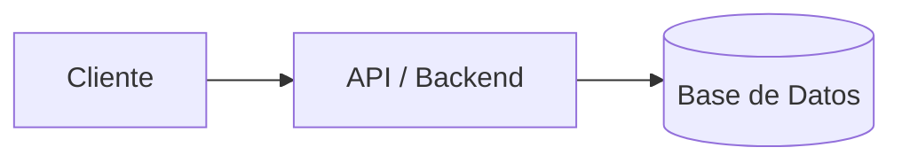

# Guía y Estándar para la Definición de Proyectos

Este documento define la estructura estándar para agregar nuevos proyectos en la colección `src/content/projects/`.

---

## 1. Plantilla Frontmatter (Metadata)

Cada archivo `.md` dentro de `src/content/projects/` debe iniciar con un bloque Frontmatter YAML configurado correctamente según el esquema definido en `src/content/config.ts`.

```yaml
---
# --- CAMPOS OBLIGATORIOS ---
order: 1                              # (number) Orden numérico de prioridad/aparición en la lista
category: "Backend & Fullstack"        # (string) Categoría principal (ej: "Backend & Fullstack", "SaaS Core", "AI Search")
tag: "FastAPI + Astro"                # (string) Tag superior o resumen de tecnología (ej: "FastAPI + Astro", "2024 · Production")
title: "Nombre del Proyecto"           # (string) Título principal del proyecto
description: "Descripción corta y concisa del proyecto que aparecerá en las cards de la landing." # (string)
tags:                                 # (string[]) Lista de badges de tecnologías secundarias/stack
  - "FastAPI"
  - "Astro 5"
  - "Tailwind CSS v4"
  - "PostgreSQL"
  - "Docker"
color: "indigo"                       # (enum: "indigo" | "violet" | "slate") Color temático del proyecto
featured: true                        # (boolean) `true` para destacar en tamaño completo en la grilla

# --- CAMPOS OPCIONALES ---
backgroundImg: "/projects/mi-hero.png"# (string, opcional) Ruta a la imagen de fondo hero del proyecto
links:                                # (array, opcional) Enlaces a repositorios, demos o documentación
  - label: "Ver Código"
    href: "https://github.com/usuario/repo"
    variant: "solid"                  # (enum: "solid" | "outline") Estilo del botón
  - label: "Ver Documentación"
    href: "https://github.com/usuario/repo/tree/main/docs"
    variant: "outline"

# --- MÉTRICAS Y DEMOS OPCIONALES ---
# chart:                              # (opcional) Para mostrar un gráfico de rendimiento/métricas
#   label: "Rendimiento"
#   liveLabel: "99.8% Uptime"
#   values: [40, 65, 80, 95, 100]
# code: "npm install mi-paquete"      # (opcional) Snippet de comando rápido
# npm:                                # (opcional) Datos de paquete npm público
#   install: "npm i mi-paquete"
#   stars: "1.2k"
---
```

---

## 2. Estructura Estándar del Cuerpo del Documento (Markdown)

A continuación se detalla la estructura recomendada para mantener consistencia visual y de lectura estilo **Obsidian**:

```markdown
# Nombre del Proyecto

**Frase destacada en negrita que resuma la propuesta de valor del proyecto.**


Descripción detallada sobre la arquitectura, propósito general y solución que aporta el proyecto.

---

## Contenido

- [Stack tecnológico](#stack-tecnológico)
- [Arquitectura general](#arquitectura-general)
- [Detalles de implementación](#detalles-de-implementación)

---

## Stack tecnológico

### Backend / API

| Tecnología | Versión | Rol |
|---|---|---|
| **Tecnología A** | v1.0 | Descripción clara de la responsabilidad del componente |
| **Tecnología B** | v2.0 | Base de datos / ORM / Autenticación |

### Frontend / Cliente

| Tecnología | Versión | Rol |
|---|---|---|
| **Astro / React** | v5.x | Renderizado, estructura y estrategia de estado |
| **Tailwind CSS** | v4.x | Estilizado y sistema de diseño |

---

## Arquitectura general



---

## Detalles de implementación

Explicación paso a paso de decisiones técnicas, eventos del DOM, manejo de estado o integraciones clave.

| Componente | Evento / Acción | Resultado |
|---|---|---|
| `ComponenteA` | `evento:disparado` | Explicación del flujo |
```
