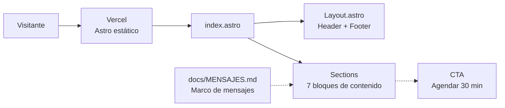
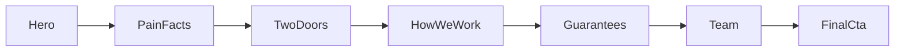

# Coworkers.cl

**Landing corporativa de Coworkers.cl, empresa de software para pymes en Concepción, Chile.**


Es el sitio público de la empresa: presenta sus **dos puertas** (*Servicios* a medida y **Mesón**, la tablet para el mostrador), explica cómo trabaja el equipo y termina invitando a **agendar una reunión inicial sin costo**. Está construido como un sitio **estático con Astro**, sin frameworks de UI, donde cada bloque de la landing es un componente independiente y el copy se mantiene en una única fuente de verdad (`docs/MENSAJES.md`).

---

## Contenido

- [Stack tecnológico](#stack-tecnológico)
- [Arquitectura general](#arquitectura-general)
- [Arquitectura de componentes](#arquitectura-de-componentes)
- [Estructura del proyecto](#estructura-del-proyecto)
- [Cómo levantar el proyecto](#cómo-levantar-el-proyecto)

---

## Stack tecnológico

### Frontend (Astro)

| Tecnología | Versión | Rol |
|---|---|---|
| **Astro** | 7.x (Node 22.12+) | Generador de sitio estático; cada sección es un componente `.astro` sin JavaScript de cliente innecesario |
| **Tailwind CSS** | 4.x | Estilos *utility-first* integrados vía `@tailwindcss/vite`, con animaciones mediante `tw-animate-css` |
| **TypeScript** | 6.x | Tipado de datos y props de los componentes, validado con `@astrojs/check` |
| **@astrojs/sitemap** | 3.x | Generación automática del `sitemap` para indexación en buscadores |

### Infraestructura y Docker

| Tecnología | Versión | Rol |
|---|---|---|
| **Docker & Docker Compose** | v2+ | Entorno de desarrollo reproducible con `Dockerfile.dev` y volúmenes montados para *hot reload* de `src/`; el repositorio incluye además un `Dockerfile` para el *build* |
| **Vercel** | — | Despliegue del sitio estático |

### SEO y visibilidad

| Recurso | Rol |
|---|---|
| `robots.txt` | Permite el rastreo de buscadores y de rastreadores de IA |
| `llms.txt` | Resumen en texto plano de la empresa pensado para asistentes de IA |
| `sitemap` | Índice de páginas generado por `@astrojs/sitemap` |
| Metadatos `og:*` | Título, descripción y *locale* `es_CL` para previsualización al compartir el enlace |

---

## Arquitectura general



El sitio se compila a HTML estático y se sirve directamente desde Vercel. No hay backend ni base de datos: la conversión ocurre a través de un botón de contacto que abre el correo de la empresa para agendar la reunión inicial.

---

## Arquitectura de componentes

Los componentes se dividen en tres carpetas según su responsabilidad:

| Carpeta | Responsabilidad | Ejemplos |
|---|---|---|
| `layout/` | Piezas que envuelven toda la página; se usan una sola vez | `Header`, `Footer` |
| `sections/` | Un componente por bloque de contenido, ensamblados en orden dentro de `index.astro`. Cada uno arma sus propios datos y **no recibe props** | `Hero`, `TwoDoors`, `Team` |
| `ui/` | Piezas reutilizables y genéricas que las secciones instancian con datos propios vía *props* | `Button`, `Eyebrow`, `Wordmark` |

### Secciones de la landing



| Componente | Contenido |
|---|---|
| `Hero` | Propuesta de valor principal y llamadas a la acción |
| `PainFacts` | *"Nos llaman cuando…"*: datos concretos sobre los dolores de las pymes (ley de datos personales, morosidad de facturas) |
| `TwoDoors` | Las dos líneas de negocio: **Servicios** (desarrollo a medida, automatizaciones, infraestructura) y **Mesón** |
| `HowWeWork` | *"Cuatro pasos. Ningún manual."*: proceso de trabajo de punta a punta |
| `Guarantees` | *"Lo que puedes exigirnos"*: cuatro compromisos con el cliente |
| `Team` | *"Nuestro equipo son estudiantes"*: historia y modelo de formación del equipo |
| `FinalCta` | Cierre con invitación a agendar 30 minutos sin costo |

### Componentes de UI

| Componente | Descripción |
|---|---|
| `Button` | Botón con variante de contorno: `primary` (color de acento) o `ghost` (neutro) |
| `Eyebrow` | Antetítulo de sección en color de acento |
| `Wordmark` | Logotipo tipográfico `coworkers.cl`, con el `.cl` resaltado en acento |

---

## Estructura del proyecto

```text
CoWorkers/
├── docker/
│   ├── Dockerfile
│   └── Dockerfile.dev
├── docs/
│   └── MENSAJES.md                     # marco de mensajes (fuente de verdad del copy)
├── public/
│   ├── robots.txt                      # permite buscadores y rastreadores de IA
│   ├── llms.txt                        # resumen en texto plano para asistentes de IA
│   └── favicon.ico / favicon-32.png / favicon-512.png
├── src/
│   ├── components/
│   │   ├── layout/                     # Header, Footer
│   │   ├── sections/                   # Hero, PainFacts, TwoDoors, HowWeWork,
│   │   │                               # Guarantees, Team, FinalCta
│   │   └── ui/                         # Button, Eyebrow, Wordmark
│   ├── layouts/
│   │   └── Layout.astro
│   └── pages/
│       └── index.astro
├── astro.config.mjs
├── docker-compose.yml
├── package.json
└── tsconfig.json
```

---

## Cómo levantar el proyecto

El proyecto está configurado para ejecutarse exclusivamente con **Docker**.

1. Asegúrate de tener **Docker** y **Docker Compose** instalados.
2. Abre una terminal en la raíz del proyecto (`CoWorkers`).
3. Construye y levanta el contenedor:

```bash
docker compose up --build -d
```

4. La aplicación estará disponible en <http://localhost:4322>. Gracias a los volúmenes montados, cualquier cambio en `src/` se refleja al instante en el navegador.

Para detener el servidor:

```bash
docker compose down
```
