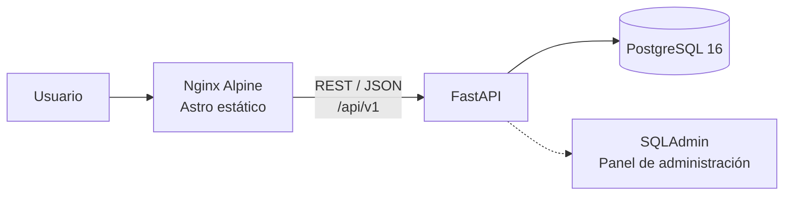
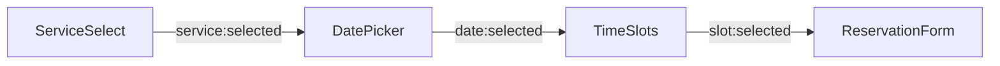

# Level Works

**Plataforma de gestión y reservas para servicios de autolavado.**

**LevelWorks** nació con la idea de poner en práctica y dominar todo el ciclo de vida de una aplicación _fullstack_ usando **FastAPI** y **Astro**.

Inicialmente, era un backend simple en FastAPI que se encargaba también de renderizar las vistas mediante _templates_ HTML. A medida que el proyecto fue evolucionando, vi la necesidad de separar responsabilidades y migré el frontend a **Astro 5**. Aprovechar su arquitectura de islas le dio una enorme ventaja en rendimiento y ligereza, adaptándose mucho mejor a las necesidades de la aplicación.

Hoy en día cuenta con una arquitectura completamente desacoplada: el backend opera como una API _API-first_ independiente en FastAPI, mientras que el frontend corre por separado en Astro con Tailwind CSS, conectados a través de REST/JSON.

---

## Contenido

- [Stack tecnológico](#stack-tecnológico)
- [Arquitectura general](#arquitectura-general)
- [Arquitectura del frontend](#arquitectura-del-frontend)

---

## Stack tecnológico

### Backend (API)

| Tecnología | Versión | Rol |
|---|---|---|
| **FastAPI** | 0.110+ (Python 3.12) | Framework asíncrono de alto rendimiento, expuesto como API JSON pura bajo `/api/v1` |
| **SQLAlchemy** | 2.0+ | ORM asíncrono |
| **PostgreSQL** | 16 | Base de datos relacional principal para producción |
| **Pydantic** | 2.x | Contratos de entrada/salida tipados (*schemas*) para cada endpoint |
| **python-jose + Bcrypt** | — | Emisión y validación de tokens JWT, y hashing de contraseñas |
| **SQLAdmin + fastapi-storages** | 0.17+ | Panel de administración integrado (SSR interno) para gestión de servicios, reservas y carga de imágenes |

### Frontend (Astro Client)

| Tecnología | Versión | Rol |
|---|---|---|
| **Astro** | 5.x | Compilación estática pura (`output: 'static'`), sin islas ni frameworks UI; la interactividad usa `<script>` nativos |
| **Tailwind CSS** | 4.x | Integrado vía `@tailwindcss/vite`, con animaciones mediante `tw-animate-css` |
| **TypeScript** | Strict | Cliente API tipado (`lib/api.ts` y `lib/types.ts`) |

### Infraestructura y Docker

| Tecnología | Versión | Rol |
|---|---|---|
| **Docker & Docker Compose** | v2+ | Contenedorización y orquestación de servicios independientes (Backend, Frontend y PostgreSQL) |
| **Nginx Alpine** | — | Servidor web de producción que entrega el *build* estático de Astro |

---

## Arquitectura general

---

## Arquitectura del frontend

El cliente funciona **sin frameworks de UI** (React/Vue). El estado del *wizard* de reserva se comparte de forma desacoplada entre componentes mediante eventos del DOM (`CustomEvents`):

| Componente | Evento que emite | Componente que lo escucha |
|---|---|---|
| `ServiceSelect` | `service:selected` | `DatePicker` |
| `DatePicker` | `date:selected` | `TimeSlots` |
| `TimeSlots` | `slot:selected` | `ReservationForm` |